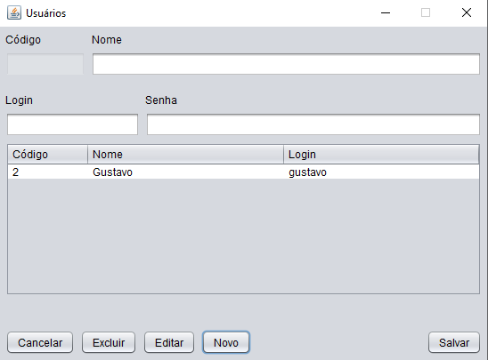
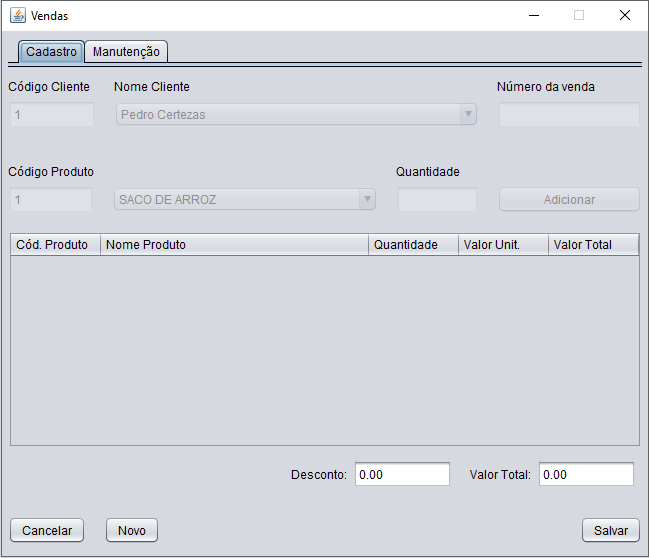

  
  
   
   

  

  <a href="#-tecnologias">Tecnologias</a>&nbsp;&nbsp;&nbsp;|&nbsp;&nbsp;&nbsp;
  <a href="#-projeto">Projeto</a>&nbsp;&nbsp;&nbsp;|&nbsp;&nbsp;&nbsp;
  <a href="#-layout">Layout</a>&nbsp;&nbsp;&nbsp;|&nbsp;&nbsp;&nbsp;
  <a href="#-licença">Licença</a>

  

 

## 🚀 Tecnologias

Esse projeto foi desenvolvido com as seguintes tecnologias:

-[Java](https://dev.java)

-[MySQL](https://www.mysql.com)

-[NetBeans](https://netbeans.apache.org)

## 💻 Projeto

O SellStationApp é um projeto simples de ERP de gestão comercial que implementa uma CRUD e funcionalidades como Logs e Suporte para criação básica de arquivos XML. Foi desenvolvido durante a Disciplina de Linguagem de Programação III.

## 📷 Screenshots

  
  
  
  
  
  

## 📝 Licença

Esse projeto está sob a licença MIT.

